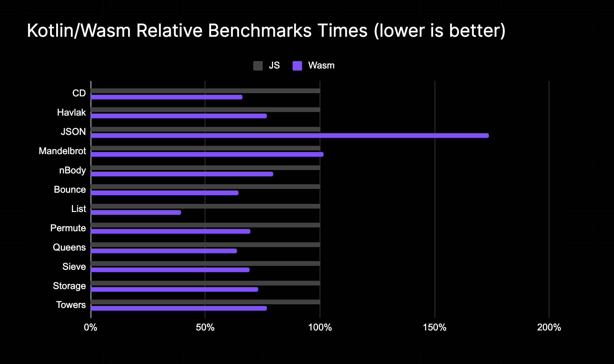
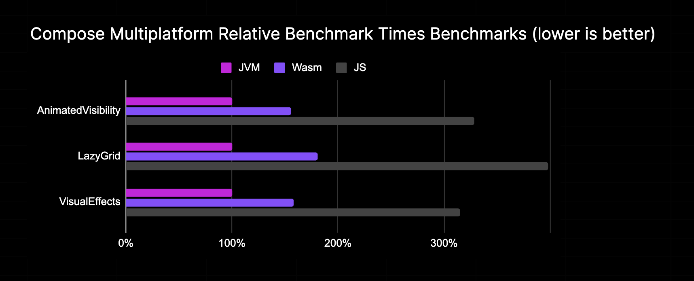

# Kotlin Wasm Benchmarks

Kotlin Multiplatform Collection of Benchmarks focused on Kotlin/Wasm performance.

_Based on data from [Compose Multiplatform Benchmarks](https://github.com/JetBrains/compose-multiplatform/tree/bench_with_kwasm/benchmarks/ios/jvm-vs-kotlin-native)_

# Description
These benchmarks are based on [are-we-fast-yet](https://github.com/smarr/are-we-fast-yet) benchmarks collection and JetBrains/Kotlin micro-benchmarks (work-in-progress).
To perform benchmarks it uses [kotlinx-benchmarks](https://github.com/Kotlin/kotlinx-benchmark) library.

# Build and Run
Specify Kotlin version in `gradle.properties` file or use additional gradle argument `-Pkotlin_version=1.8.0`.

### To run All benchmarks in V8:
`./gradlew benchmark`

### To run All Kotlin/Wasm benchmarks in V8:

`./gradlew wasmBenchmark`

### To run All Kotlin/Wasm benchmarks with binaries optimized by [Binaryen](https://github.com/WebAssembly/binaryen) in V8:

`./gradlew wasmOptBenchmark`

### To run All Kotlin/JS benchmarks in V8:

`./gradlew jsBenchmark`

### To see all tasks:

`./gradlew tasks`

### Result output is located in `build/reports` directory.

# License
See LICENSE.md file for details.
