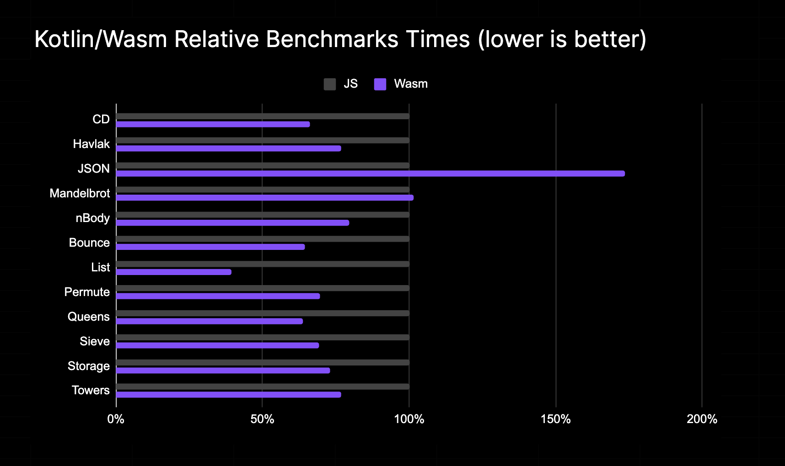
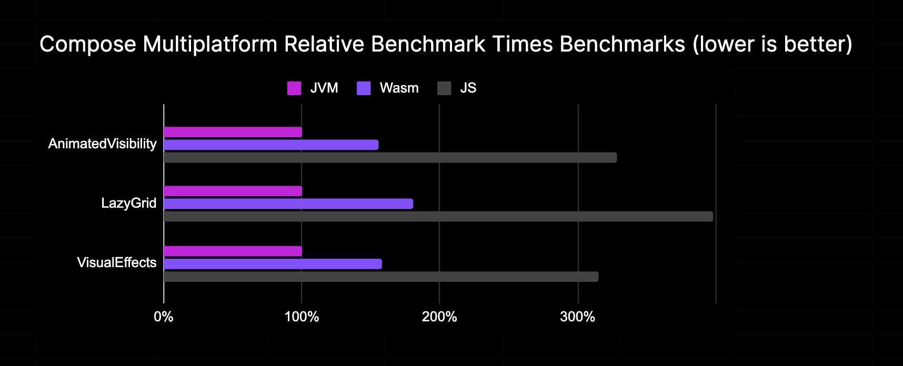

# Kotlin Wasm Benchmarks

Kotlin Multiplatform Collection of Benchmarks focused on Kotlin/Wasm performance.

_Based on data from [Compose Multiplatform Benchmarks](https://github.com/JetBrains/compose-multiplatform/tree/bench_with_kwasm/benchmarks/ios/jvm-vs-kotlin-native)_

# Description
These benchmarks are based on [are-we-fast-yet](https://github.com/smarr/are-we-fast-yet) benchmarks collection and JetBrains/Kotlin micro-benchmarks (work-in-progress).
To perform benchmarks it uses [kotlinx-benchmarks](https://github.com/Kotlin/kotlinx-benchmark) library.

# Build and Run
Specify Kotlin version in `gradle.properties` file or use additional gradle argument `-Pkotlin_version=1.8.0`.

### To run All benchmarks in V8:
`./gradlew benchmark`

### To run All Kotlin/Wasm benchmarks in V8:

`./gradlew wasmBenchmark`

### To run All Kotlin/Wasm benchmarks with binaries optimized by [Binaryen](https://github.com/WebAssembly/binaryen) in V8:

`./gradlew wasmOptBenchmark`

### To run All Kotlin/JS benchmarks in V8:

`./gradlew jsBenchmark`

### To see all tasks:

`./gradlew tasks`

### Result output is located in `build/reports` directory.

# License
See LICENSE.md file for details.

# Generic rules writing the benchmarks
### Some rules considering a benchmark writing: 
1. Whenever is possible, consume some benchmark result into `Blackhole` parameter.
2. Do not use function return value as a blackhole consumer.
3. Always prepare benchmark data in `@Setup` method.
4. Never mutate shared data in the benchmark.
5. If the benchmark uses other functions, make them top-level.
6. Prefer `const val`'s when possible.
7. Consume into blackhole as less data as possible but as consumed value should cover as much data-flow as possible.
8. If you write a micro benchmark, write as less code as possible.
9. Do not use `kotlinx.benchmakrs` annotations to tune your benchmark, use gradle file.
10. Benchmark iterations could be also tuned with a loop on the `BENCHMARK_SIZE` value.
11. Do not consume into blackhole instances of `external` classes or `external` interfaces.
12. Do not have multiple access to non-local properties in the benchmark. Read it once into a local variable and use that variable instead.